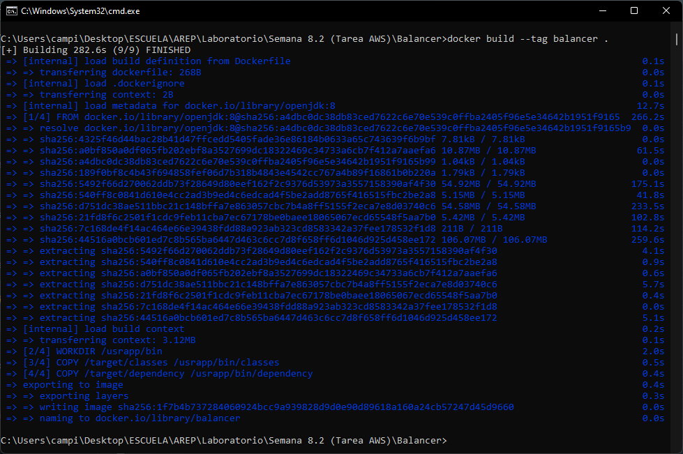

# Modularización con virtaulización (Docker - AWS)
### Arquitecturas Empresariales
#### Camilo Andrés Pichimata cárdenas
##### Marzo del 2022

## Descripción
En el presente laboratorio se desarrollará una aplicación con la siguiente arquitectura propuesta:


En donde:
- El servicio MongoDB es una instancia de MongoDB corriendo en un container de docker en una máquina virtual de EC2

- LogService es un servicio REST que recibe una cadena, la almacena en la base de datos y responde en un objeto JSON con las 10 ultimas cadenas almacenadas en la base de datos y la fecha en que fueron almacenadas.

- La aplicación web APP-LB-RoundRobin está compuesta por un cliente web y al menos un servicio REST. El cliente web tiene un campo y un botón y cada vez que el usuario envía un mensaje, este se lo envía al servicio REST y actualiza la pantalla con la información que este le regresa en formato JSON. El servicio REST recibe la cadena e implementa un algoritmo de balanceo de cargas de Round Robin, delegando el procesamiento del mensaje y el retorno de la respuesta a cada una de las tres instancias del servicio LogService.

## Desarrollo
Para complir con los requerimientos de la arquitectura propuesta se implementaron las siguientes clases:

- **Balancer.java:** Esta clase está compuesta por un cliente web y servicios REST. Desde el cliente web se envían cadenas al servicio REST y recibe de este información en formato JSON. El servicio REST recibe la cadena e implementa un algoritmo de balanceo de cargas de Round Robin que se encarga de distribuir las peticiones recibidas entre las tres instancias del servicio LogService.

- **LogService.java** LogService es un servicio REST que recibe las cadenas enviadas por el balanceador, las almacena en la base de datos y retorna un objeto JSON con las 10 ultimas cadenas almacenadas en la base de datos y la fecha en que fueron almacenadas.

## Despliege Docker
Para realizar el despliegue se generan las imágenes del LogService y el balanceador de carga, para esto se hace uso de los siguientes comandos:
    
```bash
# Imagen del balanceador de carga
docker build --tag balancer .

# Imagen de LogService
docker build --tag logservice .
```

La salida en consola al ejecutar los comandos es la siguiente:

- Balanceador de carga



- LogService


Con el comando `docker images` se puede revisar que las imagenes fueron contruidas:


Luego de creadas las imágenes, se genera una configuración auntomática usando el archivo ***docker-compose.yml*** que se muestra a continuación:

```yml
# docker-compose.yml
version: '2'

services:
    balancer:
        environment:
            - PORT=34000
        build:
            context: ./Balancer
            dockerfile: Dockerfile
        container_name: balancer
        ports:
            - "34000:4567"
        links:
            - logservice1
            - logservice2
            - logservice3

    logservice1:
        environment:
            - PORT=34001
        build:
            context: ./LogService
            dockerfile: Dockerfile
        container_name: logservice1
        links:
            - db
    
    logservice2:
        environment:
            - PORT=34002
        build:
            context: ./LogService
            dockerfile: Dockerfile
        container_name: logservice2
        links:
            - db
    
    logservice3:
        environment:
            - PORT=34003
        build:
            context: ./LogService
            dockerfile: Dockerfile
        container_name: logservice3
        links:
            - db
    
    db:
        image: mongo:3.6.1
        container_name: db
        volumes:
            - mongodb:/data/db
            - mongodb_config:/data/configdb
        command: mongod
        
volumes:
    mongodb:
    mongodb_config:

```

Para implementar la configuración anterior en docker se ejecuta el siguiente comando: 

```bash
# Configuración automática con archivo docker-compose.yml
docker compose up -d
```

Se ejecuta el comando:


Al finar la ejecución indica que los servicios especificados en el archivo docker-compose.yml se crearon correctamente:


Se verifica que se crearon los servicios al ejecutar el comando `docker ps`:


Del mismo modo se puede ver en Docker Desktop el estado de los contenedores en "Running" como se ve en la siguiente imágen:


### Carga de imagenes a Docker Hub
Se ingresa a la dirección `https://hub.docker.com/` y se ingresa con el usuaro y contraseña, luego de esto se procede a crear un nuevo repositorio dando click en el boton **Create Repository**.

Se ingresa el nombre, una descripción corta y en este caso la visibilidad como pública, como se puede ver a continuación:


Se crea una referencia a las imágenes de manera local con el nombre del repositorio usando los siguientes comandos:

```bash
# Balanceador de carga
docker tag balancer camilopichimata/arep-logservice_roundrobin_aws:balancer

# LogService
docker tag logservice camilopichimata/arep-logservice_roundrobin_aws:logservice
```

La ejecución de los comandos se puede visualizar en la siguiente imagen:


Se comprueba que se hayan creado las referencias locales al repositorio con el comando `docker images`:


Se realiza la autenticación de la cuenta de Docker Hub en caso de ser necesario con el comando `docker login`, se debe ingresar el nombre de ususario y la contraseña:


Luego de esto, se realiza en envío de las imágenes al repositorio ejecutando los siguientes comandos:

```bash
# Balanceador de carga
docker push camilopichimata/arep-logservice_roundrobin_aws:balancer

#LogService
docker push camilopichimata/arep-logservice_roundrobin_aws:logservice
```

La salida mostrada en la consola es la siguiente:

- LogService


- Balanceador de carga


Verificamos que se visualicen los push realizados en el repositorio:


Se procede a realizar el despliegue en AWS.

## Despliegue AWS

Se ingresa al curso en `awsacademy.instructure.com` en la sección _modules_ y en _Learner Lab - Foundational Services_, y se da click en el botón **Start Lab**, luego clickeamos en en donde dice AWS después de que el puntico se ha puesto de color verde.

Luego de esto llegamos a la página de inicio de la consola, donde damos click en buscar, ingresamos **EC2** y seleccionamos la primera opción:


Al cargarse la siguiente página buscamos la opción para lanzar una nueva instancia e ingresamos ahí:


Seleccionamos la imagen a utilizar, en este caso la segunda opción


Seleccionamos el tipo de instancia a utilizar


Revisamos los detalles de la instancia y damos click en el botón **Lanzar**


Creamos un par de claves, lo descargamos y damos click en el botón **Lanzar instancias**


Esperamos a que se lance la instancia


Luego de esto llegamos a una página en la que se muestra el estado de la instancia y damos click en el botón **Ver instancias**, al cargar la nueva página podemos ver que la instancia se encuentra en ejecución


Si damos click en el ID de la instancia se pueden visualizar todos los datos de esta


Al dar click en el botón **Conectar** vemos la información necesaria para conectarse a la instancia y en la pestaña **Cliente SSH** los pasos para realizar la conexión por medio de SSH


Para conectarnos untilizaremos el siguiente comando:

```bash
# Conectar a la instancia
ssh -i "Key.pem" ec2-user@ec2-18-233-9-55.compute-1.amazonaws.com
```

El comando anterior se debe ejecutar en el mismo directorio en el que guardamos la llave descargada. Después de ejecutar el comando nos conectamos a la instancia y obtenemos lo siguiente:


Ejecutamos los siguiente comandos para instalar docker en la instancia creada:

```bash
# Instalar docker 
sudo yum update -y
sudo yum install docker
```

Ejecutamos los comandos y cuando se solicite la confirmación de la instalación del paquete ingresamos `y` y damos enter


Esperamos a que se termine la instalación y ejecutamos el siguiente comando para iniciar el servicio de docker

```bash
# Iniciar servicio de docker
sudo service docker start
```


Se configura el usuario en el grupo de docker para no ingresar "sudo" cada vez que se invoque un comando, para esto se ejecuta el siguiente comando:

```bash
# Incluir al ususario en el grupo de usuarios de docker
sudo usermod -a -G docker ec2-user
```

Nos desconectamos y volvemos a conectarmos para que la configuración tome efecto, seguido a esto, procedemos a crear las instancias trayendo las imágenes del repositorio, para esto como primera opción podemos utilizar los siguientes comandos:

```bash
# Traer imagenes del balanceador de carga
# - Balanceador de carga
docker run -d -p 35000:4567 --name balancer camilopichimata/arep-logservice_roundrobin_aws:balancer

# - LogService (Tres instancias)
docker run -d --name logservice camilopichimata/arep-logservice_roundrobin_aws:logservice

# - Base de datos Mongo
docker run -d --name bd mongo:3.6.1
```

Como segunda opción se puede utilizar la configuración especificada en el archivo ***docker-compose.yml***, en este caso se realizará de esta forma, para esto se modificó con el fin de que descargue la base de datos desde el repositorio, quedando de la siguiente manera: 

```yml
# docker-compose.yml
version: '2'

services:
    balancer:
        environment:
            - PORT=34000
        image: camilopichimata/arep-logservice_roundrobin_aws:balancer
        container_name: balancer
        ports:
            - "34000:4567"
        links:
            - logservice1
            - logservice2
            - logservice3

    logservice1:
        environment:
            - PORT=34001
        image: camilopichimata/arep-logservice_roundrobin_aws:logservice
        container_name: logservice1
        links:
            - db
    
    logservice2:
        environment:
            - PORT=34002
        image: camilopichimata/arep-logservice_roundrobin_aws:logservice
        container_name: logservice2
        links:
            - db
    
    logservice3:
        environment:
            - PORT=34003
        image: camilopichimata/arep-logservice_roundrobin_aws:logservice
        container_name: logservice3
        links:
            - db
    
    db:
        image: mongo:3.6.1
        container_name: db
        volumes:
            - mongodb:/data/db
            - mongodb_config:/data/configdb
        command: mongod
        
volumes:
    mongodb:
    mongodb_config:
    
```

Para poder usar este archivo se debe cargar en el servidor, esto se hace mediante sftp al que nos conectamos ejecutando el siguiente comando:

```bash
sftp -i "Key.pem" ec2-user@ec2-52-91-70-70.compute-1.amazonaws.com
```

Para cargar el archivo se emplea el comando `put` como se puede ver a continuación:


Salimos de sftp con el comando `exit` y volvemos a conectarnos mediante ssh.

Debido a que en el servidor no se encuentra el comando `docker-compose` este debe ser instalado, para eso se ejecutan los siguientes comandos:

```bash 
# Instalar docker-compose
sudo curl -L "https://github.com/docker/compose/releases/download/1.29.2/docker-compose-$(uname -s)-$(uname -m)" -o /usr/local/bin/docker-compose

# Dar permisos de ejecución
sudo chmod +x /usr/local/bin/docker-compose

# Se verifica la instalación
docker-compose --version
```

La instalación se llevó a cabo de la siguiente manera:


Una vez instalado el comando `docker-compose` y acargado el archivo `yml` este se ejcuta de la siguiente manera:

```bash
docker-compose up -d
```

En la salida obtenida se puede ver que se iniciaron los contenedores especificados el el archivo `yml`, como se puede ver a continuación:


Para poderse conectar a la página web se debe habilitar el puerto especificado en este caso el puerto **34000**

Para hacer esto se parte del _Panel de EC2_, se ingresa a _Instancias en ejecución_, se da click en el _ID de la instancia_, se desplaza la página hacia abajo y se ingresa a la pestaña _Seguridad_ como se puede ver en la siguiente imagen:


Luego de esto se ingresa al grupo de seguridad que se puede visualizar en ese apartado de la imagen anterior, ahí se pueden visualizar las propiedades del grupo de seguridad especificado, y se encuentran las _Reglas de entrada_, damos click en el botón **Editar reglas de entrada** que se ve en la parte inferior


En esta parte damos click en el botón **Agregar regla** e ingresamos la segunda regla tal como se ve en la siguiente imagen especificando el puerto y definiendo que cualquier dirección ipv4 pueda acceder por este puerto

 

Seguido a esto damos click en el botón **Guardar reglas** que nos lleva a la página anterior y nos muestra un mensaje indicando que las reglas de entrada se guardaron correctamente


Al desplazarnos hacia abajo, se pueden visualizar las dos reglas de entrada configuradas


Finalmente se podrá acceder a la página por medio de la siguiente dirección:

```bash
http://ec2-52-91-70-70.compute-1.amazonaws.com:34000/LogService
```

**Página web:**


