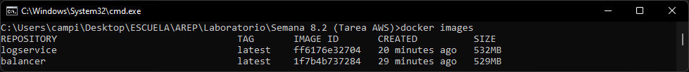

# Modularización con virtaulización (Docker - AWS)
### Arquitecturas Empresariales
#### Camilo Andrés Pichimata cárdenas
##### Marzo del 2022

## Descripción
En el presente laboratorio se desarrollará una aplicación con la siguiente arquitectura propuesta:


En donde:
- El servicio MongoDB es una instancia de MongoDB corriendo en un container de docker en una máquina virtual de EC2

- LogService es un servicio REST que recibe una cadena, la almacena en la base de datos y responde en un objeto JSON con las 10 ultimas cadenas almacenadas en la base de datos y la fecha en que fueron almacenadas.

- La aplicación web APP-LB-RoundRobin está compuesta por un cliente web y al menos un servicio REST. El cliente web tiene un campo y un botón y cada vez que el usuario envía un mensaje, este se lo envía al servicio REST y actualiza la pantalla con la información que este le regresa en formato JSON. El servicio REST recibe la cadena e implementa un algoritmo de balanceo de cargas de Round Robin, delegando el procesamiento del mensaje y el retorno de la respuesta a cada una de las tres instancias del servicio LogService.

## Desarrollo
Para complir con los requerimientos de la arquitectura propuesta se implementaron las siguientes clases:

- **Balancer.java:** Esta clase está compuesta por un cliente web y servicios REST. Desde el cliente web se envían cadenas al servicio REST y recibe de este información en formato JSON. El servicio REST recibe la cadena e implementa un algoritmo de balanceo de cargas de Round Robin que se encarga de distribuir las peticiones recibidas entre las tres instancias del servicio LogService.

- **LogService.java** LogService es un servicio REST que recibe las cadenas enviadas por el balanceador, las almacena en la base de datos y retorna un objeto JSON con las 10 ultimas cadenas almacenadas en la base de datos y la fecha en que fueron almacenadas.

## Despliege Docker
Para realizar el despliegue se generan las imágenes del LogService y el balanceador de carga, para esto se hace uso de los siguientes comandos:
    
```bash
# Imagen del balanceador de carga
docker build --tag balancer .

# Imagen de LogService
docker build --tag logservice .
```

La salida en consola al ejecutar los comandos es la siguiente:

- Balanceador de carga


- LogService


Con el comando `docker images` se puede revisar que las imagenes fueron contruidas:



